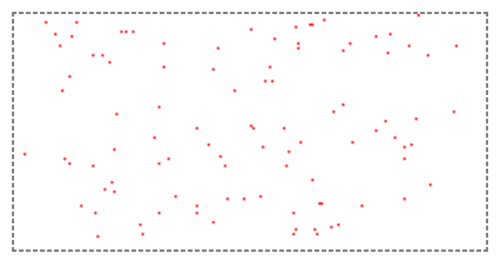

使用 canvas 在页面上绘制100个随机生成的点

<!--more-->


```
<!DOCTYPE html>  
<html>  
<head>  
    <meta charset="UTF-8">  
    <title>随机画点</title>  
    <style>  
        canvas{  
            border: 1px dashed gray; 
        }  
    </style>  
</head>  
<body>  
        <canvas id="cvs" width="200" height="100"></canvas>  
	
	
	<script>  
		
		//画布
                var cvs = document.getElementById('cvs');  
                //画笔
		var ctx = cvs.getContext('2d'); 

 
                //设置画笔颜色  
                ctx.fillStyle = "red";  
		
		//初始化数组，用它来存储各点的坐标
		var points=[];
	
		
		//调用函数，随机生成100个点，并把它们的坐标放入数组
		createPoints(100);
		
		/*
			  遍历数组，把所有的点画出来
			
				forEach()函数的参数，是一个回调函数
				参数p 表示 数组points里的一个元素，准确说是遍历到的当前元素
				
				fillRect(x,y,width,height)函数：
				填充坐标(矩形左上角)为(x,y),长宽为(width,height)的矩形
		*/
                points.forEach(function(p){  
                    ctx.fillRect(p[0], 100-p[1], 1, 1);  
                });
		
		
		
		
		
		/*
			在(0,0)-(200,100)矩形范围内，生成随机的n个点
			把这些点的坐标，放入数组
		*/
		function createPoints(n){
			for(var i=0;i<n;i++){
				//x坐标,y坐标
				var zbx = parseInt(Math.random()*201);
				var zby = parseInt(Math.random()*101);
				
				//在控制台打印“点的坐标”
				console.log("("+zbx+","+zby+")");
				
				//一个点
				var point =[];
				point[0]=zbx;
				point[1]=zby;
				
				//把数据放入数组
				points.push(point);
			}
		}
		
        </script>  
    </body>  
</html>

```