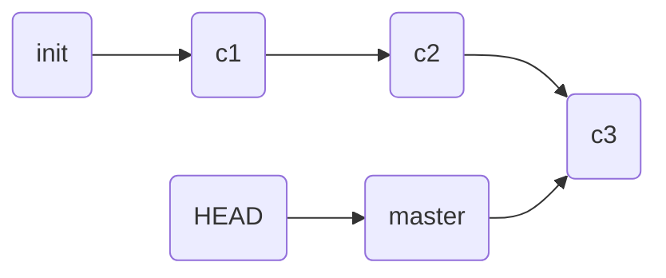

git 使用手册。

<!-- more -->

---

## 安装 git

```shell
# Linux 环境
$ yum -y install git

# windows 环境，下载 Git 客户端并安装
https://gitforwindows.org/ 
```

## 配置 git 基本参数

```shell
$ git config --global user.name 'guoxn'
$ git config --global user.email 'mixinan@163.com'
$ git config --global core.editor vim

$ git config --list   # 列出已设的配置项
user.name=guoxn
user.email=mixinan@163.com
core.editor=vim

$ cat ~/.gitconfig   # 查看配置文件
[user]
	name = guoxn
	email = mixinan@163.com
[core]
	editor = vim
```

## git 的重要概念

- 工作区：编写程序时，所有文件都在某个目录下，此目录就是工作区
- 暂存区：工作区和版本库之间的缓冲地带
- 版本库：git 在工作区中创建一个隐藏目录 .git，这个目录是版本库。它在工作区下，但不是工作区的一部分


## 初始化

- 新建项目时使用 git

```shell
$ git init new_project   # 初始化空的 Git 版本库

$ ls -A new_project/
.git
```

- 在已存在的项目中使用 git

```shell
$ mkdir devops
$ cd devops/
$ echo 'Hello World' > index.html

$ git init .   # 初始化空的 Git 版本库

$ ls -A
.git  index.html
```

## git 的使用

```shell
$ git status  # 查看状态

$ git status -s  # 查看简要信息
?? index.html

$ git add .   # 将目录下的所有内容加入暂存区，开始跟踪

$ git status -s
A  index.html

$ git rm --cached index.html   # 撤出暂存区
rm 'index.html'

$ git status -s
?? index.html

$ git add .  # 重新加入暂存区

$ git status -s
A  index.html

$ git commit  # 确认至版本库，需要用 vim 写日志

$ git status
位于分支 master
无文件要提交，干净的工作区

$ git status -s
```

## 后续使用，就是改代码、加入跟踪、确认至版本库
```shell
$ echo 'nsd' >> index.html 
$ cp /etc/hosts .
$ git status -s
M index.html
?? hosts

$ git add .
$ git status -s
A  hosts
M  index.html

$ git commit -m "modify index.html, add hosts"

$ git status
```

## 恢复误删除的文件

```shell
$ rm -rf *
$ ls

$ git status  -s
D a.txt

$ git checkout -- *
$ ls
a.txt
```

## 如果真想删除文件

```shell
$ git rm a.txt
rm 'a.txt'

$ ls

$ git status -s
D  a.txt

$ git status
# 位于分支 master
# 要提交的变更：
#   （使用 "git reset HEAD <file>..." 撤出暂存区）
#
#	删除：      hosts

$ git reset HEAD hosts
重置，然后撤出暂存区的变更：
D	hosts

$ git status
# 位于分支 master
# 尚未暂存以备提交的变更：
#   （使用 "git add/rm <file>..." 更新要提交的内容）
#   （使用 "git checkout -- <file>..." 丢弃工作区的改动）
#
#	删除：      hosts
#

修改尚未加入提交（使用 "git add" 和/或 "git commit -a"）
$ git checkout -- hosts
$ ls
hosts  index.html
```

## 删除文件的完整过程
```shell
$ git rm hosts
rm 'hosts'

$ git status -s
D  hosts

$ git commit -m "del hosts"
[master 0ddfcb2] del hosts
 1 file changed, 2 deletions(-)
 delete mode 100644 hosts

$ git checkout -- hosts
error: pathspec 'hosts' did not match any file(s) known to git.
```

## 改名、移动

```shell
$ cp /etc/passwd .
$ git add .
$ git commit -m "add passwd"
[master 1db7e89] add passwd
 1 file changed, 40 insertions(+)
 create mode 100644 passwd

$ git mv passwd mima
$ git status -s
R  passwd -> mima

$ git commit -m "rename passwd -> mima"
[master 8e1c9eb] rename passwd -> mima
 1 file changed, 0 insertions(+), 0 deletions(-)
 rename passwd => mima (100%)
```

## 切换到以前版本



将HEAD指针指向以前的某个提交就可以切换到以前的某个状态

```shell
$ git log  # 查看所有的提交，
... ...
commit 0fff998482d7630caa531f28d51587884745b423
Author: zzg <zzg@tedu.cn>
Date:   Tue May 21 14:16:04 2019 +0800

    modify index.html, add hosts
... ...
$ git checkout \ 0fff998482d7630caa531f28d51587884745b423
现在目录下出现了index.html和hosts两个文件
$ ls
index.html  hosts

# 返回到最新的提交
$ git checkout master
$ ls
index.html  mima
```

## 分支管理

git 允许不同用户创建不同的分支管理代码，还可以把分支合并到主干分支。默认情况下，git 有一个名为 master 的主干分支。

```shell
$ git branch   # 查看分支
* master
$ ls
index.html  mima

$ git branch fn1   # 新建分支
$ git branch
  fn1
* master

$ git checkout fn1  # 切换分支
切换到分支 'fn1'
$ git branch
* fn1
  master

# 在 fn1 分支中编写程序
$ cp ~/anaconda-ks.cfg .
$ git add .
$ git commit -m "fn1 add anaconda"
[fn1 619f6fb] fn1 add anaconda
 1 file changed, 65 insertions(+)
 create mode 100644 anaconda-ks.cfg

$ ls
anaconda-ks.cfg  index.html  mima

$ git checkout master   # 切回master分支
切换到分支 'master'

$ ls
index.html  mima

$ git merge fn1   # 合并 fn1 分支到主干
更新 8e1c9eb..619f6fb
Fast-forward
 anaconda-ks.cfg | 65 ++++++++++++++++++++++++++++++++++++
 1 file changed, 65 insertions(+)
 create mode 100644 anaconda-ks.cfg

$ ls
anaconda-ks.cfg  index.html  mima
```
## 删除分支

```shell
$ git branch -d fn1
已删除分支 fn1（曾为 619f6fb）。

$ git branch 
* master
```


## 指定不上传的文件夹

在使用编程语言的个别模块时，不希望上传模块文件夹到 github，因为里面文件实在太多。我们可以手动创建 git 的忽略清单，列出不上传的目录名称。

方法：
1. 在仓库目录下创建 .gitignore 文件 
2. 假如我们不想上传文件夹 node_modules，可以在该文件内写入“node_modules”，保存
3. 以后 git add 到暂存区时，就会忽略 node_modules 文件夹了

```
忽略文件或文件夹的写法：

/target/    
忽略 target 目录

log/*       
忽略 log 目录下的所有文件

css/*.css   
忽略 css 目录下后缀为 .css 的文件
```