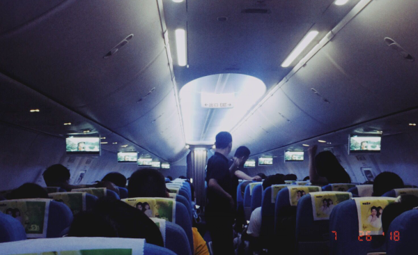

以前这趟航班，都是 19:30 起飞，飞行平稳后，发放晚餐、饮料。今天 19:40，还没有一点要起飞的样子，空姐们居然开始发放晚餐和饮料。我一下子觉得时间上很不乐观，要有大的延误了，并且她们好像没想主动告诉我们情况。现在 20:05，再不飞，到南京又没有地铁了，只能先乘大巴车到市里，然后打出租车回去，要多花钱，也要折腾不少时间。

<!--more-->

---

    

昨晚上返回南京。

出发前，我下载了一些 C# 学习资料，打算充分利用在路上的时间学习一下。不料，候机时在微博刷到《局面》采访周立波口中“某某”的视频，就一鼓作气把一个系列采访都看完了，之后再刷了刷他们之间的爱恨情仇八卦。就到登机时间了。

居然又赶上航班延误，我在机舱里如坐针毡，身心不舒服，毫无心思学习。2个小时后广播说收到通知可以起飞了，飞机助跑时扭扭歪歪很不稳，像是正在考驾照科目三的新手在开，腾空后的前30秒，多次在失重、超重之间切换，周围的女乘客们惊慌尖叫。我怀疑飞机是不是有故障，今天能否顺利抵达南京，我不知道。我的情绪开始变得失落、焦躁。

飞行平稳以后，我特别疲惫，趴在托板上睡着了。空间狭小，姿势难受，脸压在胳膊上，胳膊不舒服，脸也感到别扭，可能是口腔什么神经受到压迫，直流口水，我只好又坐了起来。

终于熬到落地，地铁早已停运，我需要的机场大巴2号线居然也停运，只好买了大巴1号线的票，先到市里再说。

上了大巴，灯光昏暗，在后排靠窗位置找到一个空位。我让坐外面的人起来，直接坐到了两个座位中间(打算先坐下，然后再往左边挪一点就能坐到我位置上)，没想到，中间不全是沙发，有个不易察觉的金属硬物，顶到了我右边大腿，我忍着痛不露声色坐了过去，心里直骂娘。

戴耳机放起音乐，好像没几秒就睡着了。双手没地儿放，我就怀抱背包，脸也贴着它，一直到了终点站。下了大巴，本想叫滴滴，但被一个又一个出租车司机纠缠，我也不想再等了，只想以最快速度躺到床上睡觉，就上了出租车。回去已经凌晨1点半了。

刷微博到3点钟，才睡去。相当不爽的旅途。
