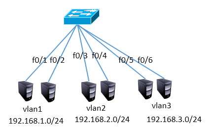
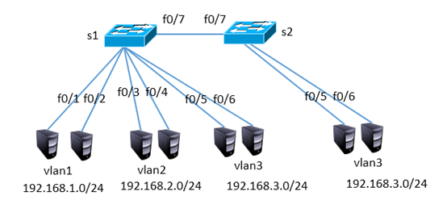
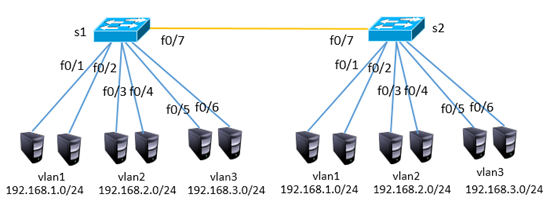
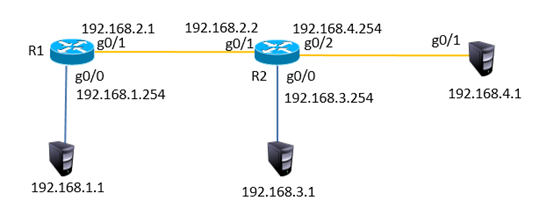
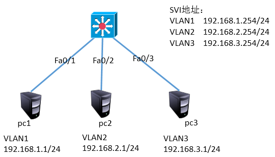
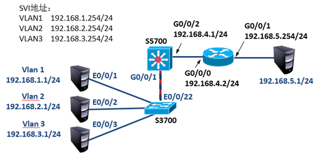
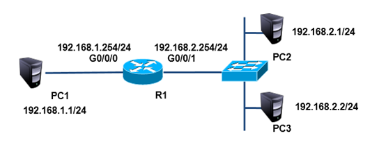

华为交换机、路由器的使用

<!-- more -->

---

# day01：交换机的基本使用

**改变命令行视图**

```shell
<Huawei>system-view               //从用户视图，进入系统视图
[Huawei]interface Ethernet 0/0/1    //进入接口视图
[Huawei-Ethernet0/0/1]quit        //返回上一视图
[Huawei]
[Huawei]interface Ethernet 0/0/1    //再次进入接口视图
[Huawei-Ethernet0/0/1]return        //返回用户视图
<Huawei>
```

**修改交换机主机名**

```shell
<Huawei>system-view    //进入系统视图
[Huawei]sysname SW1    //命名为 SW1
[SW1]
```

**显示 VRP 版本**

```shell
[Huawei]display version 

Huawei Versatile Routing Platform Software
VRP (R) software, Version 5.110 (S3700 V200R001C00)
Copyright (c) 2000-2011 HUAWEI TECH CO., LTD
Quidway S3700-26C-HI Routing Switch uptime is 0 week, 0 day, 0 hour, 17 minutes
```

**查看交换机配置**

```shell
[Huawei]display current-configuration 

sysname Huawei
cluster enable
ntdp enable
ndp enable
drop illegal-mac alarm
diffserv domain default
drop-profile default
...
```

**使用账户和密码登录**

```shell
<Huawei>system-view 
[Huawei]aaa                    //进入aaa认证
[Huawei-aaa]local-user a01 password cipher 123   //用户a01,密码123       
[Huawei-aaa]quit
[Huawei]user-interface console 0        
[Huawei-ui-console0]authentication-mode aaa        //激活配置
```

**保存交换机配置**

```shell
<Huawei>save        

The current configuration will be written to the device.
Are you sure to continue?[Y/N]y                    //按 y 确认

Info: Please input the file name ( *.cfg, *.zip ) [vrpcfg.zip]:
Mar 12 2019 19:12:18-08:00 Huawei %%01CFM/4/SAVE(l)[0]:The user chose Y when dec
iding whether to save the configuration to the device.
Now saving the current configuration to the slot 0.
Save the configuration successfully.
```

**恢复出厂设置**
```shell
<Huawei>reset saved-configuration     //重置配置文件

Warning: The action will delete the saved configuration in the device.
The configuration will be erased to reconfigure. Continue? [Y/N]:y   //是否擦除

Warning: Now clearing the configuration in the device.
Mar 12 2019 19:13:50-08:00 Huawei %%01CFM/4/RST_CFG(l)[1]:The user chose Y when 
deciding whether to reset the saved configuration.
Info: Succeeded in clearing the configuration in the device.

<Huawei>reboot        //重启设备

Info: The system is now comparing the configuration, please wait.
Warning: All the configuration will be saved to the configuration file for the n
ext startup:, Continue?[Y/N]:n            //是否再次保存，选择n

Info: If want to reboot with saving diagnostic information, input 'N' and then e
xecute 'reboot save diagnostic-information'.
System will reboot! Continue?[Y/N]:y    //是否重启，选择y
```

**在交换机中查看MAC地址表**

```shell
[Huawei]display mac-address

MAC address table of slot 0:
-------------------------------------------------------------------------------
MAC Address    VLAN/       PEVLAN CEVLAN Port            Type      LSP/LSR-ID  
               VSI/SI                                              MAC-Tunnel  
-------------------------------------------------------------------------------
5489-987d-68c4 1           -      -      Eth0/0/1        dynamic   0/-         
5489-9806-61a2 1           -      -      Eth0/0/2        dynamic   0/-           
-------------------------------------------------------------------------------
```

# day02：vlan 虚拟局域网

## 案例1：划分VLAN



默认情况下所有接口都在 VLAN1 中，且 VLAN1 默认就存在，所以只需配置 VLAN2 和 VLAN3

```shell
<Huawei>system-view 
[Huawei]vlan batch 2 3        //创建VLAN2、VLAN3

[Huawei]port-group 1
[Huawei-port-group-1]group-member Ethernet0/0/3 Ethernet0/0/4
[Huawei-port-group-1]port link-type access 
[Huawei-port-group-1]port default vlan 2     

[Huawei-port-group-1]quit

[Huawei]port-group 2
[Huawei-port-group-2]group-member Ethernet0/0/5 Ethernet0/0/6
[Huawei-port-group-2]port link-type access 
[Huawei-port-group-2]port default vlan 3  
```

## 案例2：多交换机VLAN的划分



**步骤(在案例1的基础上)**

S1配置
```shell
[Huawei]interface Ethernet0/0/7
[Huawei-Ethernet0/0/7] port link-type access
[Huawei-Ethernet0/0/7] port default vlan 3
```

S2配置
```shell
<Huawei>system-view 
[Huawei]vlan 3            //创建VLAN3

[Huawei]port-group 1
[Huawei-port-group-1]group-member Ethernet0/0/5 to Ethernet0/0/7
[Huawei-port-group-1]port link-type access 
[Huawei-port-group-1]port default vlan 3    
```

## 案例3：配置trunk中继链路



**步骤(在案例2的基础上)**

S1配置

```shell
[Huawei]interface Ethernet0/0/7
[Huawei-Ethernet0/0/7]port default vlan 1  //还原配置

[Huawei-Ethernet0/0/7]port link-type trunk
[Huawei-Ethernet0/0/1]port trunk allow-pass vlan all
```

S2配置

```shell
<Huawei>system-view 
[Huawei]vlan 2         //创建VLAN2

[Huawei]port-group 1
[Huawei-port-group-1]group-member Ethernet0/0/3 Ethernet0/0/4
[Huawei-port-group-1]port link-type access 
[Huawei-port-group-1]port default vlan 2                        

[Huawei]interface Ethernet0/0/7
[Huawei-Ethernet0/0/7]port default vlan 1   //还原配置

[Huawei-Ethernet0/0/7]port link-type trunk
[Huawei-Ethernet0/0/1]port trunk allow-pass vlan all
```

## 案例4：链路聚合配置


S1配置
```shell
[Huawei]interface Eth-trunk 1
[Huawei- Eth-trunk1]trunkport ethernet 0/0/1  0/0/2
```

S2配置

```shell
[Huawei]interface Eth-trunk 1
[Huawei- Eth-trunk1]trunkport ethernet 0/0/1  0/0/2
```

## 案例5：配置静态路由



R1配置

```shell
<Huawei>system-view 
[Huawei]interface GigabitEthernet 0/0/0
[Huawei-GigabitEthernet0/0/1]ip address 192.168.1.254 24
[Huawei-GigabitEthernet0/0/1]quit

[Huawei]interface GigabitEthernet 0/0/1
[Huawei-GigabitEthernet0/0/1]ip address 192.168.2.1 24

//ip  route-static  目标网段  子网掩码   下一跳地址
[Huawei]ip route-static 192.168.3.0 24 192.168.2.2
[Huawei]ip route-static 192.168.4.0 24 192.168.2.2
```

R2配置

```shell
<Huawei>system-view 
[Huawei]interface GigabitEthernet 0/0/0
[Huawei-GigabitEthernet0/0/1]ip address 192.168.3.254 24
[Huawei-GigabitEthernet0/0/1]quit

[Huawei]interface GigabitEthernet 0/0/1
[Huawei-GigabitEthernet0/0/1]ip address 192.168.2.2 24
[Huawei-GigabitEthernet0/0/1]quit

[Huawei]interface GigabitEthernet 0/0/2
[Huawei-GigabitEthernet0/0/1]ip address 192.168.4.254 24

[Huawei]ip route-static 192.168.1.0 24 192.168.2.1
```

## 案例6：三层交换机基本配置



三层交换机配置

```shell
[Huawei]vlan batch 2 3    //创建VLAN2、VLAN3

[Huawei]interface Vlanif 1
[Huawei-Vlanif1]ip address 192.168.1.254 24

[Huawei]interface Vlanif 2
[Huawei-Vlanif1]ip address 192.168.2.254 24

[Huawei]interface Vlanif 3
[Huawei-Vlanif1]ip address 192.168.3.254 24

[Huawei]interface Ethernet0/0/2
[Huawei-Ethernet0/0/7] port link-type access
[Huawei-Ethernet0/0/7] port default vlan 2

[Huawei]interface Ethernet0/0/3
[Huawei-Ethernet0/0/7] port link-type access
[Huawei-Ethernet0/0/7] port default vlan 3
```

# day03：

## 案例1：动态路由

通过配置静态路由协议ospf实现全网互通



S3700交换机配置

```
[Huawei]vlan batch 2 3     //创建VLAN2、3

[Huawei]interface Ethernet0/0/2
[Huawei-Ethernet0/0/2]port default vlan 2

[Huawei]interface Ethernet0/0/3
[Huawei-Ethernet0/0/3]port default vlan 3

[Huawei]interface Ethernet0/0/22
[Huawei-Ethernet0/0/22]port link-type trunk
[Huawei-Ethernet0/0/22]port trunk allow-pass vlan all
```

S5700交换机配置

```shell
[Huawei]vlan batch 2 3 4       //创建VLAN2、3、4

[Huawei]interface Vlanif 1
[Huawei-Vlanif4]ip address  192.168.1.254 24

[Huawei]interface Vlanif 2
[Huawei-Vlanif4]ip address  192.168.2.254 24

[Huawei]interface Vlanif 3
[Huawei-Vlanif4]ip address  192.168.3.254 24

[Huawei]interface Vlanif 4
[Huawei-Vlanif4]ip address  192.168.4.1 24

//查看配置过的ip情况
display  ip  interface  brief

[Huawei]interface GigabitEthernet 0/0/1
[Huawei-GigabitEthernet0/0/1] port link-type trunk
[Huawei-GigabitEthernet0/0/1] port trunk allow-pass vlan all

[Huawei]interface GigabitEthernet 0/0/2
[Huawei-GigabitEthernet0/0/2] port link-type access
[Huawei-GigabitEthernet0/0/2] port default vlan 4

[Huawei]ospf 1
[Huawei-ospf-1]area 0
[Huawei-ospf-1-area-0.0.0.0]network 192.168.1.0 0.0.0.255
[Huawei-ospf-1-area-0.0.0.0]network 192.168.2.0 0.0.0.255
[Huawei-ospf-1-area-0.0.0.0]network 192.168.3.0 0.0.0.255
[Huawei-ospf-1-area-0.0.0.0]network 192.168.4.0 0.0.0.255

[Huawei]ip route-static 0.0.0.0 0.0.0.0 192.168.4.2
```

路由器配置

```shell
[Huawei]interface GigabitEthernet 0/0/0
[Huawei-GigabitEthernet0/0/0] ip address  192.168.4.2 24

[Huawei]interface GigabitEthernet 0/0/1
[Huawei-GigabitEthernet0/0/0] ip address  192.168.5.254 24

[Huawei]ospf 1
[Huawei-ospf-1]area 0
[Huawei-ospf-1-area-0.0.0.0]network 192.168.4.0 0.0.0.255
```

## 案例2：基本ACL的配置（1）

按下图拓扑结构，禁止主机pc2与pc1通信，而允许所有其他流量


1，为路由器g0/0/0接口配置ip 192.168.1.254，为路由器g0/0/1接口配置ip 192.168.2.254

```shell
[Huawei]interface GigabitEthernet 0/0/0
[Huawei-GigabitEthernet0/0/0] ip address  192.168.1.254 24
[Huawei]acl 2000
[Huawei-acl-basic-2000]rule deny source 192.168.2.1 0

[Huawei]interface GigabitEthernet 0/0/1
[Huawei-GigabitEthernet0/0/1]ip address  192.168.2.254 24
[Huawei-GigabitEthernet0/0/1]traffic-filter inbound acl 2000
```

## 案例3：基本ACL的配置（2）

按下图拓扑结构，允许主机pc2与pc1互通，而禁止其他设备访问pc1


注：此案例需要提前配置好所有设备的ip地址

```
[Huawei]acl 2001
[Huawei-acl-basic-2001]rule permit source 192.168.2.1 0
[Huawei-acl-basic-2001]rule deny source any
[Huawei]interface GigabitEthernet 0/0/1
[Huawei-GigabitEthernet0/0/1]undo traffic-filter inbound acl 2000
[Huawei-GigabitEthernet0/0/1] traffic-filter inbound acl 2001
```

## 案例4：高级ACL

按下图拓扑结构，禁止pc2访问pc1的ftp服务，禁止pc3访问pc1的www服务，所有主机的其他服务不受限制



注：此案例需要提前配置好所有设备的ip地址

```
[Huawei]acl 3000
[Huawei-acl-adv-3000]rule deny tcp source 192.168.2.1 0 destination 192.168.1.1 
0 destination-port eq 21
[Huawei-acl-adv-3000]rule deny tcp source 192.168.2.2 0 destination 192.168.1.1 
0 destination-port eq 80
[Huawei]interface g0/0/1
[Huawei-GigabitEthernet0/0/1]traffic-filter inbound acl 3000      //在接口中应用acl
```