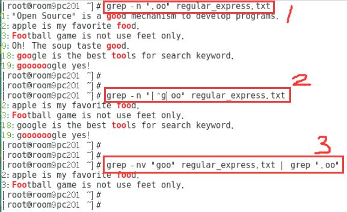

昨天讲“正则表达式”时，遇到一个小问题。因为是在课堂上，我回答得比较匆忙，没细心研究。后来想了一下，发现我的解答是片面的。实现功能的前提是，正确理解需求。需求理解有误，结果就会大相径庭。昨天那个题目本身，有两个模棱两可的意思，导致对需求的理解不同，实现方式自然也就不相同了。正确的做法，是我针对题目的两种理解，分别讲解实现方式。因为在真正的工作中，需求是非常明确的，不会出现含糊不清的情况。

<!-- more -->

# 题目：过滤不想要"oo"前面有 g 的

    

我们假设 x=“不是 g 的其它单一字符”，针对题目本身这句话，可以有两种理解：  
## 1.筛选出“包含 xoo”的行
## 2.筛选出“包含 xoo，但不包含 goo”的行

两种理解，会产生两种需求，实现方式也不一样。

昨天有的人认为是第一种，有的人认为是第二种。

我昨天被大家的争论带得反复跑偏，一会儿认为是第一种，一会儿认为是第二种，有点懵。汉语博大精深，理解成任意一种，感觉都对。

# 当我认为是第二种时：

    grep -n "[^g]oo" regular_express.txt

结果：

    2:apple is my favorite food.
    3:Football game is not use feet only.
    18:google is the best tools for search keyword.
    19:goooooogle yes!

这条命令呈现出来的结果有瑕疵，因为还是有“goo”出现： 
第 18 行，出现了 google  
第 19 行，出现了 goooooole

我们甚至稀里糊涂聊到，正则表达式还是不够完美，还是有没考虑到的情况，它的开发人员需要在优先级方面再琢磨下。以目前的题目来看，作为用户，想要实现需求，可以使用下方命令的写法，就不会出现 goo 了：

    grep -vn "goo" regular_express.txt | grep ".oo"

结果：

    2:apple is my favorite food.
    3:Football game is not use feet only.

达到效果了，但又觉得这条命令的意义，和题目的需求也不是一回事。因为：

## 我又被你们带跑偏成第一种了……

包含 xoo 的行，都显示出来了吗？并没有。

第 18 行，有个 tools，其中 too 符合条件，为什么不显示？

第 19 行，最后两个 o 的前面也不是 g，其中 ooo 符合条件，为什么也不显示？

## 在两种声音中来回打转。但当时并没有意识到，是题目本身有两种含糊不清的意思。

看得出来，写那篇练习文档和答案的人，他是按第一种理解的。

总之，不是正则表达式有 bug，而是我们把需求理解错啦，至少理解得不一致。这是语文问题，不是技术问题。大家肯为技术动脑筋、去争论，是一个非常好的现象。当然，在真正的工作中，需求都是非常明确的，想要实现什么功能，一清二楚，不会出现这样的理解问题。^_^